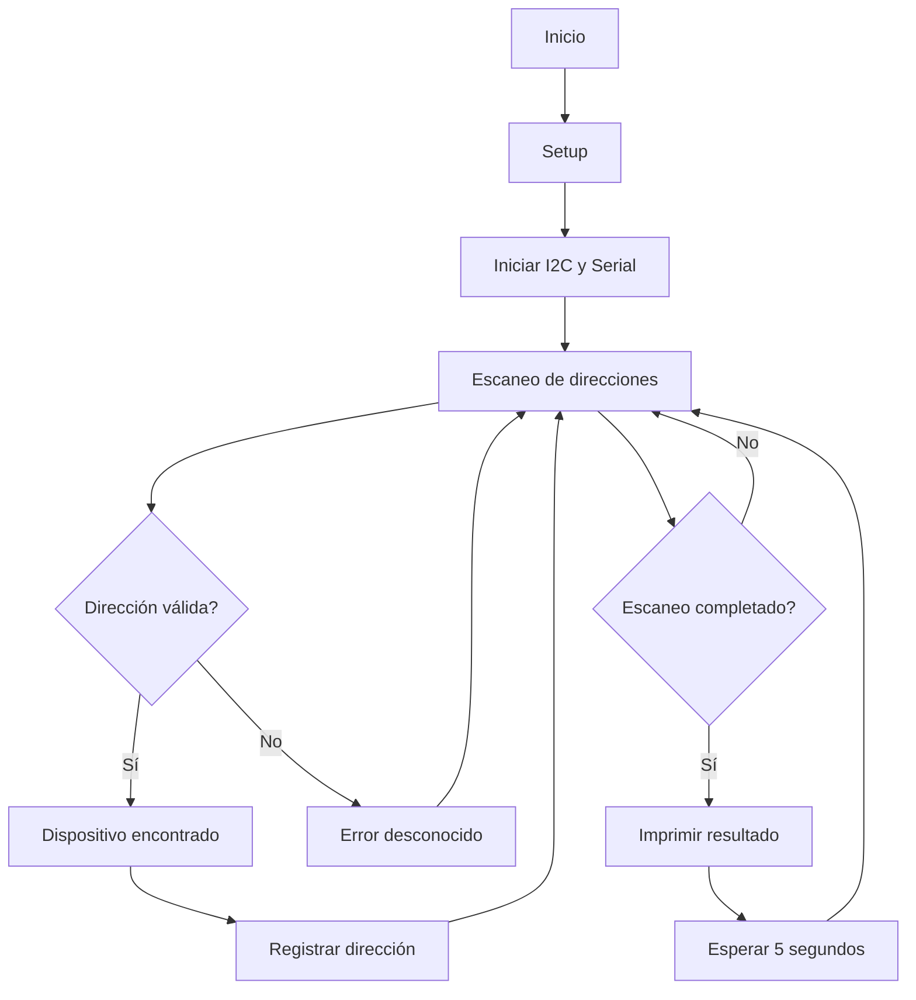
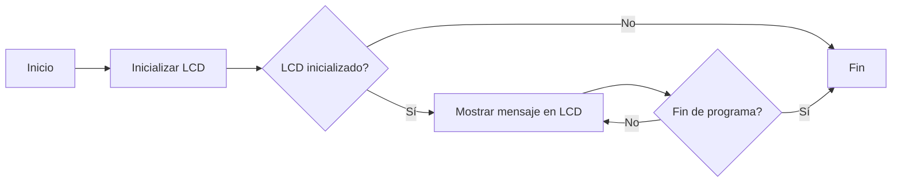

# PRACTICA-5
# Práctica 5: Comunicación I2C

## Objetivos
- Comprender el funcionamiento de los buses de comunicación entre periféricos, tanto internos como externos al procesador.
- Crear un escáner para identificar dispositivos conectados a un bus I2C.
- Implementar un sistema para visualizar información en un display OLED mediante el protocolo I2C.

## Materiales
- ESP32-S3
- Dispositivos con interfaz I2C
- Display OLED SSD1306 (para la segunda parte)
- Librerías necesarias:
  ```
  lib_deps =
  	marcoschwartz/LiquidCrystal_I2C@^1.1.4
  ```

---

## Parte 1: Escáner I2C
### Descripción
Este programa permite detectar dispositivos conectados al bus I2C en un microcontrolador ESP32-S3. A través de la función `loop()`, el escáner itera sobre todas las direcciones I2C posibles (del 1 al 127), intentando comunicarse con cada una. Si un dispositivo responde, se registra su dirección en el puerto serie.

### Código
```cpp
#include <Arduino.h>
#include <Wire.h>

void setup() {
    Wire.begin(5,6); // Pines del ESP32-S3 para I2C
    Serial.begin(115200);
    while (!Serial);
    Serial.println("\nI2C Scanner");
}

void loop() {
    byte error, address;
    int nDevices = 0;
    Serial.println("Scanning...");
    
    for(address = 1; address < 127; address++ ) {
        Wire.beginTransmission(address);
        error = Wire.endTransmission();
        
        if (error == 0) {
            Serial.print("I2C device found at address 0x");
            if (address < 16) Serial.print("0");
            Serial.print(address, HEX);
            Serial.println(" !");
            nDevices++;
        } else if (error == 4) {
            Serial.print("Unknown error at address 0x");
            if (address < 16) Serial.print("0");
            Serial.println(address, HEX);
        }
    }
    
    if (nDevices == 0) Serial.println("No I2C devices found\n");
    else Serial.println("done\n");
    
    delay(5000); // Espera 5 segundos antes del siguiente escaneo
}
```

### Salida en puerto serie
Ejemplo de salida si se encuentran dispositivos:
```
Scanning...
I2C device found at address 0x27 !
done
```
Si no se encuentran dispositivos:
```
Scanning...
No I2C devices found
```

### Diagrama de flujo


---

## Parte 2: Display OLED I2C
### Descripción
Este código permite utilizar un display OLED conectado por I2C para mostrar un mensaje en pantalla.

### Código
```cpp
#include <LiquidCrystal_I2C.h>

LiquidCrystal_I2C lcd(0x27,20,4); // Dirección del LCD

void setup() {
    Wire.begin(5,6);
    lcd.init();
    lcd.backlight();
    lcd.setCursor(3,0);
    lcd.print("Hello, world!");
    lcd.setCursor(2,1);
    lcd.print("Ywrobot Arduino!");
    lcd.setCursor(0,2);
    lcd.print("Arduino LCM IIC 2004");
    lcd.setCursor(2,3);
    lcd.print("Power By Ec-yuan!");
}

void loop() {
    // No es necesario realizar acciones en loop
}
```

### Salida en display
El mensaje mostrado en la pantalla OLED será:
```
Hello, world!
Ywrobot Arduino!
Arduino LCM IIC 2004
Power By Ec-yuan!
```

### Diagrama de flujo


---

## Conclusiones
- Se logró identificar dispositivos conectados al bus I2C, permitiendo diagnosticar problemas de conexión y reconocer las direcciones de los periféricos.
- Se implementó un sistema de visualización con un display OLED mediante el protocolo I2C, mostrando información en pantalla de manera eficiente.
- La comunicación I2C es una herramienta clave en la interconexión de dispositivos en sistemas embebidos, permitiendo la integración de múltiples sensores y actuadores con un mínimo de conexiones físicas.

