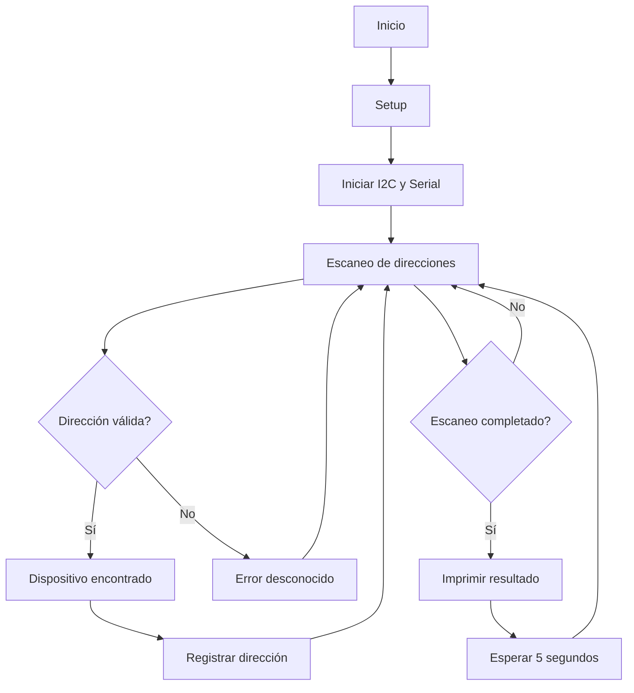
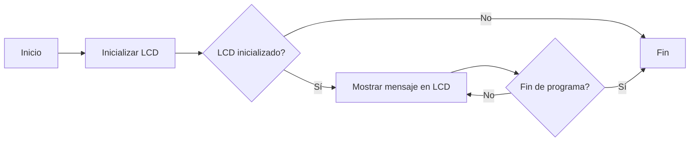

# PRACTICA-5
# Práctica 5: Comunicación I2C

## Objetivos
- Comprender el funcionamiento de los buses de comunicación entre periféricos, tanto internos como externos al procesador.
- Crear un escáner para identificar dispositivos conectados a un bus I2C.
- Implementar un sistema para visualizar información en un display OLED mediante el protocolo I2C.

## Materiales
- ESP32-S3
- Dispositivos con interfaz I2C
- Display OLED SSD1306 (para la segunda parte)
---

## Parte 1: Escáner I2C
### Descripción
Este programa permite detectar dispositivos conectados al bus I2C en un microcontrolador ESP32-S3. A través de la función `loop()`, el escáner itera sobre todas las direcciones I2C posibles (del 1 al 127), intentando comunicarse con cada una. Si un dispositivo responde, se registra su dirección en el puerto serie.

### Código
```cpp
#include <Arduino.h>
#include <Wire.h>
void setup()
{
Wire.begin();
Serial.begin(115200);
while (!Serial);
Serial.println("\nI2C Scanner");
}
void loop()
{
byte error, address;
int nDevices;
Serial.println("Scanning...");
nDevices = 0;
for(address = 1; address < 127; address++ )
{
Wire.beginTransmission(address);
error = Wire.endTransmission();
if (error == 0)
{
Serial.print("I2C device found at address 0x");
if (address<16)
Serial.print("0");
Serial.print(address,HEX);
Serial.println(" !");
nDevices++;
}
else if (error==4)
{
Serial.print("Unknown error at address 0x");
if (address<16)
Serial.print("0");
Serial.println(address,HEX);
}
}
if (nDevices == 0)
Serial.println("No I2C devices found\n");
else
Serial.println("done\n");
delay(5000);
}
```


### Salida en puerto serie
Ejemplo de salida si se encuentran dispositivos:
```
Scanning...
I2C device found at address 0x27 !
done
```
Si no se encuentran dispositivos:
```
Scanning...
No I2C devices found
```

### Diagrama de flujo


---

## Parte 2: Display OLED I2C
### Descripción
Este código permite utilizar un display OLED conectado por I2C para mostrar un mensaje en pantalla.

### Código

```
#include <Wire.h>
#include <Adafruit_GFX.h>
#include <Adafruit_SSD1306.h>

// Definir las dimensiones del OLED y la dirección I2C
#define SCREEN_WIDTH 128
#define SCREEN_HEIGHT 64
#define OLED_RESET -1 // No utilizamos un pin de reset
Adafruit_SSD1306 display(SCREEN_WIDTH, SCREEN_HEIGHT, &Wire, OLED_RESET);

void setup() {
  Serial.begin(115200); // Inicializar comunicación serie

  // Inicializar la comunicación I2C en los pines SDA (21) y SCL (20) para ESP32
  Wire.begin(21, 20); // Usa los pines 21 (SDA) y 20 (SCL)

  // Inicializar el display OLED con la dirección I2C 0x3C
  if (!display.begin(SSD1306_SWITCHCAPVCC, 0x3C)) {
    Serial.println(F("No se pudo encontrar un display OLED"));
    for (;;); // Detener el programa si no se encuentra el display
  }

  // Limpiar la pantalla
  display.clearDisplay();
  display.setTextSize(1);
  display.setTextColor(SSD1306_WHITE);
  display.setCursor(0, 0);

  // Mostrar mensaje inicial
  display.println(F("Escaneando dispositivos I2C..."));
  display.display();
  delay(1000);
}

void loop() {
  byte error, address;
  int nDevices = 0;

  display.clearDisplay(); // Limpiar la pantalla antes de mostrar resultados
  display.setCursor(0, 0); // Ubicar el cursor en la parte superior

  // Escanear direcciones I2C de 1 a 126
  for (address = 1; address < 127; address++) {
    Wire.beginTransmission(address);
    error = Wire.endTransmission();

    if (error == 0) {
      // Si se encuentra un dispositivo, mostrar su dirección en hexadecimal
      display.print(F("Dispositivo I2C en: 0x"));
      if (address < 16) display.print("0"); // Asegurarse de que la dirección tiene 2 dígitos
      display.println(address, HEX); // Mostrar dirección en formato hexadecimal
      nDevices++;
    } else if (error == 4) {
      // Error desconocido
      display.print(F("Error en: 0x"));
      if (address < 16) display.print("0");
      display.println(address, HEX);
    }
  }

  // Si no se encontraron dispositivos, mostrar mensaje correspondiente
  if (nDevices == 0) {
    display.println(F("No se encontraron dispositivos"));
  } else {
    display.println(F("Escaneo completado"));
  }

  display.display(); // Actualizar pantalla con los resultados
  delay(5000); // Esperar 5 segundos antes de hacer otro escaneo
}
```

### Salida en display
El mensaje mostrado en la pantalla OLED será:
```
Hello, world!
Ywrobot Arduino!
Arduino LCM IIC 2004
Power By Ec-yuan!
```

### Diagrama de flujo


---

## Conclusiones
- Se logró identificar dispositivos conectados al bus I2C, permitiendo diagnosticar problemas de conexión y reconocer las direcciones de los periféricos.
- Se implementó un sistema de visualización con un display OLED mediante el protocolo I2C, mostrando información en pantalla de manera eficiente.
- La comunicación I2C es una herramienta clave en la interconexión de dispositivos en sistemas embebidos, permitiendo la integración de múltiples sensores y actuadores con un mínimo de conexiones físicas.

