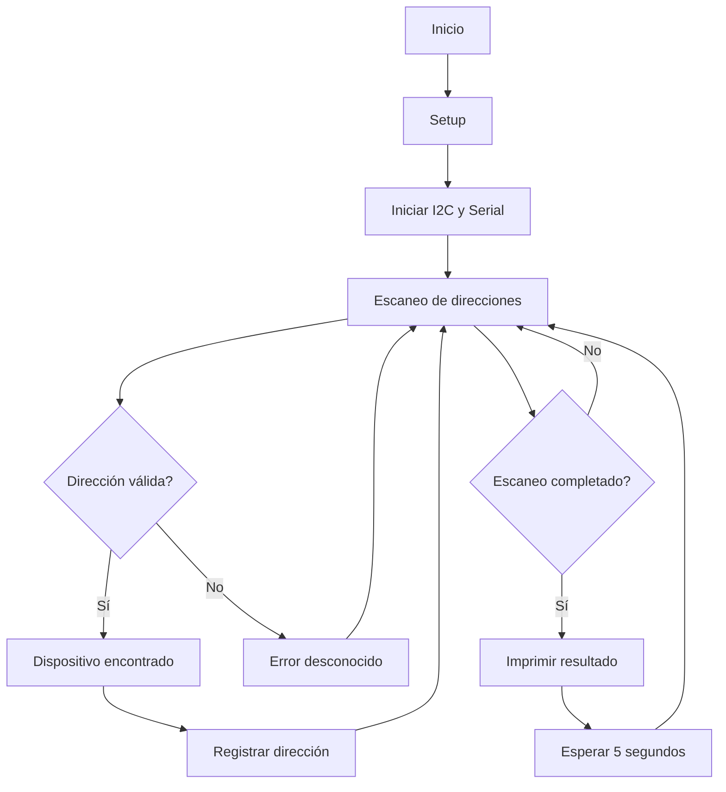
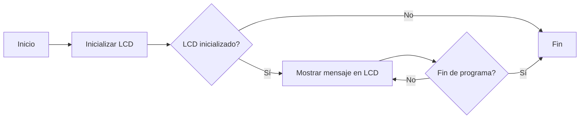

# PRACTICA-5
# Práctica 5: Comunicación I2C

## Objetivos
- Comprender el funcionamiento de los buses de comunicación entre periféricos, tanto internos como externos al procesador.
- Crear un escáner para identificar dispositivos conectados a un bus I2C.
- Implementar un sistema para visualizar información en un display OLED mediante el protocolo I2C.

## Materiales
- ESP32-S3
- Dispositivos con interfaz I2C
- Display OLED SSD1306 (para la segunda parte)
---

## Parte 1: Escáner I2C
### Descripción
Este programa permite detectar dispositivos conectados al bus I2C en un microcontrolador ESP32-S3. A través de la función `loop()`, el escáner itera sobre todas las direcciones I2C posibles (del 1 al 127), intentando comunicarse con cada una. Si un dispositivo responde, se registra su dirección en el puerto serie.

### Código
```cpp
#include <Arduino.h>
#include <Wire.h>
void setup()
{
Wire.begin();
Serial.begin(115200);
while (!Serial);
Serial.println("\nI2C Scanner");
}
void loop()
{
byte error, address;
int nDevices;
Serial.println("Scanning...");
nDevices = 0;
for(address = 1; address < 127; address++ )
{
Wire.beginTransmission(address);
error = Wire.endTransmission();
if (error == 0)
{
Serial.print("I2C device found at address 0x");
if (address<16)
Serial.print("0");
Serial.print(address,HEX);
Serial.println(" !");
nDevices++;
}
else if (error==4)
{
Serial.print("Unknown error at address 0x");
if (address<16)
Serial.print("0");
Serial.println(address,HEX);
}
}
if (nDevices == 0)
Serial.println("No I2C devices found\n");
else
Serial.println("done\n");
delay(5000);
}
```


### Salida en puerto serie
Ejemplo de salida si se encuentran dispositivos:
```
Scanning...
I2C device found at address 0x27 !
done
```
Si no se encuentran dispositivos:
```
Scanning...
No I2C devices found
```

### Diagrama de flujo


---

## Parte 2: Display OLED I2C
### Descripción
Este código permite utilizar un display OLED conectado por I2C para mostrar un mensaje en pantalla.

### Código

```cpp
#include <Wire.h>
#include <Adafruit_GFX.h>
#include <Adafruit_SSD1306.h>

// Definir las dimensiones del OLED y la dirección I2C
#define SCREEN_WIDTH 128
#define SCREEN_HEIGHT 64
#define OLED_RESET -1 // No utilizamos un pin de reset
Adafruit_SSD1306 display(SCREEN_WIDTH, SCREEN_HEIGHT, &Wire, OLED_RESET);

void setup() {
  Serial.begin(115200); // Inicializar comunicación serie

  // Inicializar la comunicación I2C en los pines SDA (21) y SCL (20) para ESP32
  Wire.begin(21, 20); // Usa los pines 21 (SDA) y 20 (SCL)

  // Inicializar el display OLED con la dirección I2C 0x3C
  if (!display.begin(SSD1306_SWITCHCAPVCC, 0x3C)) {
    Serial.println(F("No se pudo encontrar un display OLED"));
    for (;;); // Detener el programa si no se encuentra el display
  }

  // Limpiar la pantalla
  display.clearDisplay();
  display.setTextSize(1);
  display.setTextColor(SSD1306_WHITE);
  display.setCursor(0, 0);

  // Mostrar mensaje inicial
  display.println(F("Escaneando dispositivos I2C..."));
  display.display();
  delay(1000);
}

void loop() {
  byte error, address;
  int nDevices = 0;

  display.clearDisplay(); // Limpiar la pantalla antes de mostrar resultados
  display.setCursor(0, 0); // Ubicar el cursor en la parte superior

  // Escanear direcciones I2C de 1 a 126
  for (address = 1; address < 127; address++) {
    Wire.beginTransmission(address);
    error = Wire.endTransmission();

    if (error == 0) {
      // Si se encuentra un dispositivo, mostrar su dirección en hexadecimal
      display.print(F("Dispositivo I2C en: 0x"));
      if (address < 16) display.print("0"); // Asegurarse de que la dirección tiene 2 dígitos
      display.println(address, HEX); // Mostrar dirección en formato hexadecimal
      nDevices++;
    } else if (error == 4) {
      // Error desconocido
      display.print(F("Error en: 0x"));
      if (address < 16) display.print("0");
      display.println(address, HEX);
    }
  }

  // Si no se encontraron dispositivos, mostrar mensaje correspondiente
  if (nDevices == 0) {
    display.println(F("No se encontraron dispositivos"));
  } else {
    display.println(F("Escaneo completado"));
  }

  display.display(); // Actualizar pantalla con los resultados
  delay(5000); // Esperar 5 segundos antes de hacer otro escaneo
}
```

En la segunda parte, se adapta el escáner I2C para mostrar las direcciones en una pantalla OLED SSD1306 en vez del monitor serie, usando la librería Adafruit_SSD1306.h. La pantalla se inicializa en la dirección I2C 0x3C y muestra un mensaje de inicio. Luego, el bucle principal escanea las direcciones I2C y muestra los resultados en la OLED. Si no se detectan dispositivos, aparece el mensaje "No hay dispositivos I2C", permitiendo visualizar directamente en la pantalla los dispositivos encontrados.

**Codigo para que por la pantalla salga un mensaje personalizado:**
```cpp
#include <Wire.h>
#include <Adafruit_GFX.h>
#include <Adafruit_SSD1306.h>


#define SCREEN_WIDTH 128
#define SCREEN_HEIGHT 64
#define OLED_RESET -1 // No estamos usando un pin de reset
Adafruit_SSD1306 display(SCREEN_WIDTH, SCREEN_HEIGHT, &Wire, OLED_RESET);


void setup() {
  Serial.begin(115200);


  // Inicializar la comunicación I2C en los pines 21 (SDA) y 20 (SCL)
  Wire.begin(21, 20);
  
  // Inicializar el display con la dirección I2C 0x3C (o 0x3D dependiendo de tu pantalla)
  if (!display.begin(SSD1306_SWITCHCAPVCC, 0x3C)) {
    Serial.println(F("No se pudo encontrar un display OLED"));
    for (;;); // Detener el programa si no se encuentra el display
  }


  // Limpiar la pantalla
  display.clearDisplay();


  // Configurar el texto en la pantalla
  display.setTextSize(2);
  display.setTextColor(SSD1306_WHITE);
  display.setCursor(0, 0);
  display.print(F("¡Daniel y Mireia!"));
  display.display();
}


void loop() {
  // Lo que quieras actualizar en la pantalla
}
```

Por ultimo en la pantalla OLED muestra un mensaje fijo de bienvenida con una fuente más grande. El código solo configura la pantalla y despliega el texto, demostrando su uso para mostrar información sin escanear dispositivos I2C.

### Diagrama de flujo


---

## Conclusiones
- Se logró identificar dispositivos conectados al bus I2C, permitiendo diagnosticar problemas de conexión y reconocer las direcciones de los periféricos.
- Se implementó un sistema de visualización con un display OLED mediante el protocolo I2C, mostrando información en pantalla de manera eficiente.
- La comunicación I2C es una herramienta clave en la interconexión de dispositivos en sistemas embebidos, permitiendo la integración de múltiples sensores y actuadores con un mínimo de conexiones físicas.

## **Ejercicio de mejora de nota:**

### **Parte 1:**
```cpp
#include <Wire.h>
#include <Adafruit_GFX.h>
#include <Adafruit_SSD1306.h>
#include "MAX30105.h"
#include "spo2_algorithm.h"

// Definir los pines I2C personalizados para ESP32-S3
#define SDA_PIN 21  
#define SCL_PIN 22

// Configuración OLED
#define SCREEN_WIDTH 128
#define SCREEN_HEIGHT 64
Adafruit_SSD1306 display(SCREEN_WIDTH, SCREEN_HEIGHT, &Wire, -1);

// Sensor MAX30105
MAX30105 particleSensor;
uint32_t irBuffer[100], redBuffer[100];
int32_t spo2, heartRate;
int8_t validSPO2, validHeartRate;

void setup() {
  Serial.begin(115200);
  Wire.begin(SDA_PIN, SCL_PIN);  // Configurar I2C

  // Iniciar pantalla OLED
  if (!display.begin(SSD1306_SWITCHCAPVCC, SCREEN_ADDRESS)) {
    Serial.println("Fallo en OLED SSD1306");
    while (1);
  }
  display.clearDisplay();
  display.setTextSize(1);
  display.setTextColor(SSD1306_WHITE);
  display.setCursor(0, 0);
  display.println("Iniciando...");
  display.display();

  // Iniciar sensor MAX30105
  if (!particleSensor.begin(Wire, I2C_SPEED_STANDARD)) {
    Serial.println("Sensor MAX30105 no encontrado");
    while (1);
  }

  // Configuración optimizada para MAX30105
  particleSensor.setup(69, 4, 2, 100, 411, 4096);  // Configuración optimizada para HR + SpO2
}

void loop() {
  // Leer 100 muestras del sensor
  for (byte i = 0; i < 100; i++) {
    while (!particleSensor.available()) particleSensor.check();
    redBuffer[i] = particleSensor.getRed();
    irBuffer[i] = particleSensor.getIR();
    particleSensor.nextSample();
  }

  // Calcular SpO2 y HR
  maxim_heart_rate_and_oxygen_saturation(irBuffer, 100, redBuffer, &spo2, &validSPO2, &heartRate, &validHeartRate);

  // Mostrar en pantalla OLED
  display.clearDisplay();
  display.setCursor(0, 0);
  display.print("HR: ");
  display.println(validHeartRate ? String(heartRate) + " BPM" : "N/A");
  display.print("SpO2: ");
  display.println(validSPO2 ? String(spo2) + " %" : "N/A");
  display.display();

  Serial.print("HR: ");
  Serial.print(validHeartRate ? String(heartRate) + " BPM" : "N/A");
  Serial.print(" | SpO2: ");
  Serial.println(validSPO2 ? String(spo2) + " %" : "N/A");

  delay(1000);
}


```
El ESP32-S3 se configura para medir la frecuencia cardíaca y SpO₂ usando un sensor MAX30105, con los resultados mostrados en una pantalla OLED SSD1306. Se establece la comunicación I2C a través de los pines SDA 21 y SCL 22, y se verifica el funcionamiento del sensor y la pantalla. En cada ciclo, se toman 100 lecturas de luz roja e infrarroja, que luego se procesan con la función maxim_heart_rate_and_oxygen_saturation() para calcular los valores. Los datos se actualizan cada segundo tanto en el OLED como en el monitor serie.


### **Parte 2:**
```cpp
#include <WiFi.h>
#include <Wire.h>
#include <Adafruit_GFX.h>
#include <Adafruit_SSD1306.h>
#include "MAX30105.h"
#include "spo2_algorithm.h"

// Configuración WiFi
const char* ssid = "Nautilus";     
const char* password = "20000Leguas"; 

// Servidor Web
WiFiServer server(80);

// Configuración OLED
#define SCREEN_WIDTH 128
#define SCREEN_HEIGHT 64
Adafruit_SSD1306 display(SCREEN_WIDTH, SCREEN_HEIGHT, &Wire, -1);

// Sensor MAX30105
MAX30105 particleSensor;
uint32_t irBuffer[100], redBuffer[100];
int32_t spo2, heartRate;
int8_t validSPO2, validHeartRate;

// Pines I2C para ESP32-S3
#define SDA_PIN 21 
#define SCL_PIN 22 

void setup() {
  Serial.begin(115200);
  Wire.begin(SDA_PIN, SCL_PIN);

  // Conexión a WiFi
  WiFi.begin(ssid, password);
  Serial.print("Conectando a WiFi");
  while (WiFi.status() != WL_CONNECTED) {
    delay(500);
    Serial.print(".");
  }
  Serial.println("\nWiFi conectado!");
  Serial.print("IP: ");
  Serial.println(WiFi.localIP());
  server.begin();

  // Iniciar OLED
  if (!display.begin(SSD1306_SWITCHCAPVCC, SCREEN_ADDRESS)) {
    Serial.println("Fallo en OLED");
    while (1);
  }
  display.clearDisplay();
  display.setTextSize(1);
  display.setTextColor(SSD1306_WHITE);
  display.setCursor(0, 0);
  display.println("Iniciando...");
  display.display();

  // Iniciar sensor MAX30105
  if (!particleSensor.begin(Wire, I2C_SPEED_STANDARD)) {
    Serial.println("Sensor MAX30105 no encontrado");
    while (1);
  }
  particleSensor.setup(69, 4, 2, 100, 411, 4096);
}

void loop() {
  // Manejar clientes web
  WiFiClient client = server.available();
  if (client) {
    String request = client.readStringUntil('\r');
    client.flush();

    // Enviar datos al cliente
    String response = "HTTP/1.1 200 OK\r\nContent-Type: text/html\r\n\r\n";
    response += "<!DOCTYPE html><html><head><meta http-equiv='refresh' content='1'>";
    response += "<style>body{font-family:Arial;text-align:center;} .data{font-size:2em;color:blue;}</style>";
    response += "</head><body>";
    response += "<h2>Monitor de Frecuencia Cardiaca y SpO2</h2>";
    response += "<p>Frecuencia Cardiaca: <span class='data'>" + String(validHeartRate ? String(heartRate) + " BPM" : "N/A") + "</span></p>";
    response += "<p>SpO2: <span class='data'>" + String(validSPO2 ? String(spo2) + " %" : "N/A") + "</span></p>";
    response += "</body></html>";

    client.print(response);
    client.stop();
  }

  // Leer datos del sensor
  for (byte i = 0; i < 100; i++) {
    while (!particleSensor.available()) particleSensor.check();
    redBuffer[i] = particleSensor.getRed();
    irBuffer[i] = particleSensor.getIR();
    particleSensor.nextSample();
  }

  maxim_heart_rate_and_oxygen_saturation(irBuffer, 100, redBuffer, &spo2, &validSPO2, &heartRate, &validHeartRate);

  // Mostrar en OLED
  display.clearDisplay();
  display.setCursor(0, 0);
  display.print("HR: ");
  display.println(validHeartRate ? String(heartRate) + " BPM" : "N/A");
  display.print("SpO2: ");
  display.println(validSPO2 ? String(spo2) + " %" : "N/A");
  display.display();

  // Mostrar en Monitor Serie
  Serial.print("HR: ");
  Serial.print(validHeartRate ? String(heartRate) + " BPM" : "N/A");
  Serial.print(" | SpO2: ");
  Serial.println(validSPO2 ? String(spo2) + " %" : "N/A");

  delay(1000);
}


```
El sensor y la pantalla OLED siguen operando, pero ahora con conexión WiFi. El ESP32 se vincula a una red usando un SSID y contraseña y lanza un servidor web en el puerto 80. En cada ciclo, procesa peticiones HTTP y genera una página con HTML y CSS que muestra los datos en tiempo real, refrescándose cada segundo. Así, la frecuencia cardíaca y el SpO₂ pueden visualizarse tanto en la pantalla OLED como en cualquier dispositivo conectado a la misma red.

